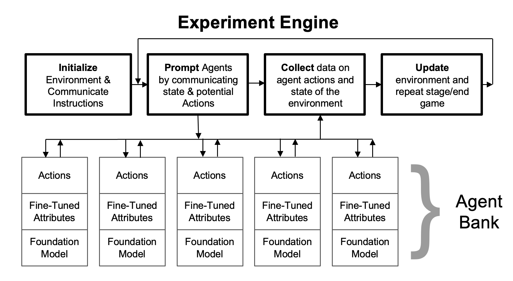

 Large Language Models (LLMs) are proving to be a powerful toolkit for management and organizational research. While early work has largely focused on the value of these tools for data processing and replicating survey-based research, the potential of LLMs for theory-building is yet to be recognized. 
 
 We argue that LLMs can accelerate the pace at which researchers can develop, validate, and extend management theory. We propose a novel framework called Generative AI-Based Experimentation (GABE) that enables researchers to conduct exploratory in silico experiments that can mirror the complexities of real-world organizational settings, featuring multiple agents and strategic interdependencies. 
 
 

This approach is unique because it allows researchers to unpack mechanisms through prompting agents to reveal explanations behind strategic decisions and by directly modifying agents' roles, preferences, and capabilities. We apply this framework to a novel theory studying strategic exploration under uncertainty. 
 
 We show how our framework can not only replicate the results from experiments with human subjects at a much lower cost, but can also be used to extend theory by clarifying boundary conditions and uncovering mechanisms. We conclude that LLMs possess tremendous potential to complement existing methods for theorizing in the social sciences.

### To Cite this work:

```markdown
Tranchero, M., Brenninkmeijer, C., Murugan, A., & Nagaraj, A. (2024). Theorizing with Large Language Models.
```